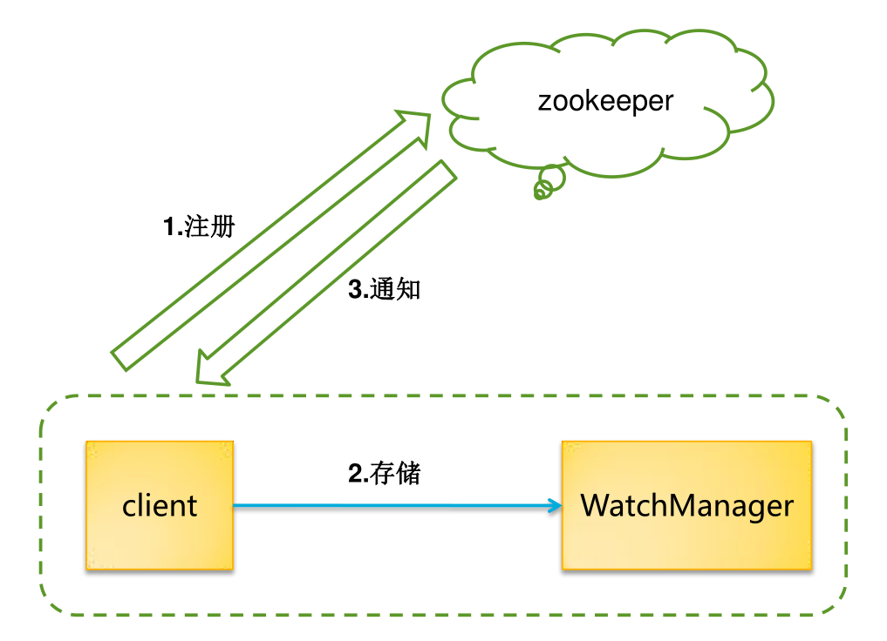
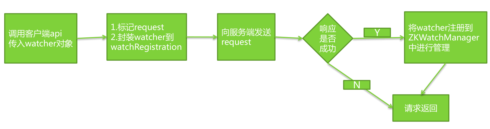

# first-knowledge-for-zookeeper
first knowledge for zookeeper

https://blog.csdn.net/weijifeng_/article/details/79775738

https://www.cnblogs.com/felixzh/p/5869212.html

## 可视化视图管理

- [ZooInspector](https://issues.apache.org/jira/secure/attachment/12436620/ZooInspector.zip)
- [zkui](https://github.com/learn-middleware/zkui)

# Zookeeper 用于分布式系统协调

## 协调：多个节点一起完成的一个动作

## 举例

- 集群成员管理
- 锁
- 选主
- 同步
- 发布/订阅
  
## 典型应用场景

- 数据发布/订阅

数据发布/订阅即所谓的配置中心：发布者将数据发布到 zk 的一个或者一系列节点上，订阅者进行数据订阅，当数据有变化时，可以及时得到数据的变化通知

- 负载均衡

本质是利用 zookeeper 的配置管理功能，涉及的步骤为：

1. 服务提供者把自己的域名及 IP 端口的映射注册到 zk 中
2. 服务费者通过域名从 zk 中获取到对应的 IP 及端口，这个 IP 及端口有多个，只是获取其中一个
3. 当服务提供者宕机时，对应的域名 IP 的对应就会减少一个映射
4. 阿里的 dubbo 服务框架就是基于 zk 来实现服务路由和负载

- 分布式协调/通知

1. 通过 watcher 和通知机制实现
2. 分布式锁
3. 分布式事务

- 集群管理

1. 当前集群中的机器数量
2. 集群中机器的运行时状态
3. 集群中节点的上下线操作
4. 集群节点的统一配置

- Master 选举

1. 临时节点
2. 顺序节点

- 分布式锁

1. 排他锁
2. 共享锁

- 分布式队列

1. FIFO

## 基本概念

### 集群角色

- Leader：为客户端提供读和写服务
- Follower: 提供读服务，所有写服务都需要转交给 Leader 角色，参与选举
- Observer：提供读服务，不参与选举过程，一般是为了增强 zk 集群的读请求并发能力

### 会话

- zk 的客户端与 zk 的服务端之间的链接
- 通过心跳检测保持客户端链接的存活
- 接收来自服务端的 watch 事件通知
- 可以设置超时时间

### 数据节点(Znode)

- 不是机器的意思
– Zk 树形结构中的数据节点，用于存储数据
– 持久节点：一旦创建，除非主动调用删除操作，否则一直存储在 zk 上
– 临时节点：与客户端的会话绑定，一旦客户端会话失效，这个客户端创建的所有临时节点都会被移除
– SEQUENTIAL Znode：创建节点时，如果设置属性SEQUENTIAL，则会自动在节点后面追加一个整型数数字

### 版本

- Version：当前 Znode 的版本
- Cversion：当前 Znode 的子节点的版本
- Aversion: 当前 Znode 的 ACL(访问控制)版本

### Watcher

- 作用于 Znode 节点上
- 多种事件通知：数据更新，子节点状态等

### ACL

- Access Control Lists
- 类似于 linux/unix 的权限控制
- CREATE 创建子节点的权限
- READ: 获取节点数据和子节点列表的权限
- WRITE：更新节点数据的权限
- DELETE：删除子节点的权限
- ADMIN：设置节点 ACL 的权限

## 基础进阶

### 数据节点(Znode)

- zk 树形结构中的数据节点，用于存储数据
- 持久节点(Persistent)：一旦创建，除非主动调用删除操作，否则一直存储在 zk 上
- 临时节点(ephemeral)：与客户端的会话绑定，一旦客户端会话失效，这个客户端创建的所有临时节点都会被移除(`create -e`)
- Persistent_sequential：创建子节点时，如果设置属性 sequential,则会自动在节点后面追加一个整型数字，上限是整型的最大值


### 顺序节点

#### 带前缀

- 创建顺序节点 1，节点数据为 321 `create -s /zk-test/seq 321`
- 创建顺序节点 2，节点数据内容为 322 `create -s /zk-test/seq 322`
- 查看所有创建的顺序子节点 `ls /zk-test`

#### 不带前缀

- 创建顺序节点 1，节点数据为 321 `create -s /zk-test/ 321`
- 创建顺序节点 2，节点数据内容为 322 `create -s /zk-test/ 322`
- 查看所有创建的顺序子节点 `ls /zk-test`

## zk 进阶 watcher

### 问题

- 集群中有多个机器，当某个通用的配置发生变化后，怎么让所有服务器的配置都统一生效？
- 当某个集群节点宕机，其他节点怎么知道？

```
zk 中引入了 watcher 机制来实现了发布/订阅功能，能够让多个订阅者同时监听某一个主题对象，当这个主题对象自身状态变化时，会通知所有订阅者。
```

### Watcher 组成

- 客户端
- 客户端  watchManager
- zk 服务器



### Watcher 机制

- 客户端向 zk 服务器注册 watcher 的同时，会将 watcher 对象存储在客户端的 watchManager
- zk 服务器触发 watch 事件后，会向客户端发送通知，客户端线程从 watchManager 中调起 watcher 执行

### Watcher 接口

- `public void process(WatchedEvent watchedEvent) {`

### Watcher 事件

- 通知状态：`org.apache.zookeeper.Watcher.Event.KeeperState`
- 事件类型：`org.apache.zookeeper.Watcher.Event.EventType`

<table>
<head>
<tr>
    <td>keeperState</td>
    <td>EventType</td>
    <td>触发条件</td>
    <td>说明</td>
</tr>
</head>
<tbody>
<tr>
    <td rowspan="5"> SyncConnected 
    <td>None(-1)</td>
    <td>客户端与服务器成功建立会话</td>
    <td rowspan="5">此时客户端和服务器处于连接状态</td>
</tr>

<tr>
<td>NodeCreated(1)</td>
<td>Watcher 监听的对应数据节点被创建</td>
</tr>

<tr>
<td>NodeDeleted(2)</td>
<td>Watcher 监听的对应数据节点被删除</td>
</tr>

<tr>
<td>NodeDataChanged(3)</td>
<td>数据节点的数据内容发生变更</td>
</tr>

<tr>
<td>NodeChildrenChanged(4)</td>
<td>被监听的数据节点的字节点列表发生变更</td>
<tr>

<tr>
<td>Disconnected(0)</td>
<td>None(-1)</td>
<td>客户端与 zk 服务器端口连接</td>
<td>此时客户端和服务器处于断开连接状态</td>
</tr>

<tr>
<td>Expired(-112)</td>
<td>None(-1)</td>
<td>会话超时</td>
<td>此时客户端会话失效，通常会收到 SessionExpiredException 异常</td>
</tr>

<tr>
<td>AuthFailed(4)</td>
<td>None(-1)</td>
<td>1.使用错误的 scheme 进行权限检查</br>2.SASL 权限检查失败</td>
<td>通常会收到 AuthFailedException 异常</td>
</tr>

<tr>
<td>Unknown(-1)</td>
<td></td>
<td></td>
<td rowspan="2">从3.1.0版本开始已经废弃</td>
</tr>

<tr>
<td>NoSyncConnected</td>
<td></td>
<td></td>
</tr>

</tbody>
</table>

#### NodeDataChanged 事件

- 无论节点数据发生变化还是数据版本发生变化都会触发
- 即使被更新数据与新数据一样，数据版本都会发生变化

#### NodeChildrenChanged

- 新增节点或者删除节点

#### AuthFailed

- 重点不是客户端会话没有权限而是授权失败

> 客户端只能收到相关事件通知，但是并不能获取到对应数据节点的原始数据内容以及变更后的新数据内容；因此，如果业务需要知道变更前的数据或者变更后的新数据，需要业务保存变更前的数据和调用接口获取新的数据

#### 创建 zk 客户端对象实例时注册

- ZooKeeper(String connectString, int sessionTimeout, Watcher watcher)
- ZooKeeper(String connectString, int sessionTimeout, Watcher watcher, boolean canBeReadOnly)
- ZooKeeper(String connectString, int sessionTimeout, Watcher watcher, long sessionId, byte[] sessionPasswd)
- ZooKeeper(String connectString, int sessionTimeout, Watcher watcher, long sessionId, byte[] sessionPasswd, boolean canBeReadOnly)

> 通过这种方式注入的 watcher 将会作为整个 zk 会话期间的默认 watcher，会一直被保存在客户端 ZKWatchManager  的 defaultWatcher 中，如果有其他设置，则这个 watcher 会被覆盖

#### 其他注册 api

- getChildren(String path, Watcher watcher)
- getChildren(String path, boolean watch)
 >> Boolean watch 表示是否使用上下文中默认的 watcher，即创建 zk 实例时设置的 watcher
- getData(String path, boolean watch, Stat stat)
 >> Boolean watch 表示是否使用上下文中默认的 watcher，即创建 zk 实例时设置的 watcher
- getData(String path, Watcher watcher, AsyncCallback.DataCallback cb, Object ctx)
- exists(String path, boolean watch)
 >> Boolean watch 表示是否使用上下文中默认的 watcher，即创建 zk 实例时设置的 watcher
- exists(String path, Watcher watcher)

```
Watcher 设置后，一旦触发一次即会失效，如果需要一直监听，就需要再注册
```

### 客户端 watcher 注册流程



## LICENSE

